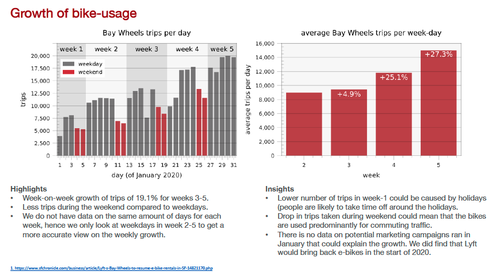

covid19
==============================

**Objective:** Business Analysis of Bay Wheels trips (Lyft's bikes) in Jan-20. 

**General process:** 
Bay Wheels shares [monthly logs of bike anonimised bike usage](https://www.lyft.com/bikes/bay-wheels/system-data). We download the data from Jan 2020, clean it and perform an extensive EDA. We create a report (pdf), where we use extensive (automated) formatting on selected plot from this EDA to get them ready for use in high-end powerpoint reports. The latter outlines a method to automated certain powerpoint reports, in cases where (business requirements) prefer static reports over dashboards.

Outlook
------------
The work done is this notebook, opens that path to additional projects in the future:
* Analyse additional months, to analyse longer term trends. All data-processing undertaken in this file is programatically and hence easy to re-run on additional data. More data would open up interesting temporal analysis using i.e. ETS or ARIMA models.
* Create a dashboard to monitor trips over time (we could simulate a real-time monitoring scenario). Multiple options to do this, using i.e. Tableau, Dash or Bokeh, depending on goals (i.e. improve Dash proficiency).

Recommended setup
------------
To get the best experience viewing the jupyter notebooks, we advice to use jupyterlabs, with the *table-of-contents* (toc) extension. 

Project Organization
------------

    ├── README.md          
    ├── data                 <- All data-files, raw & various stages of processing.
    │
    ├── notebooks            <- notebooks to process data, perform the EDA and generate the report
    │
    ├── requirements.txt     <- The requirements file for reproducing the analysis environment, e.g.
    │                           generated with `pip freeze > requirements.txt`
    │
    ├── src                  <- Source code for use in this project.
    │
    └── Lyft_Bay_Wheels.pdf  <- final report

--------
